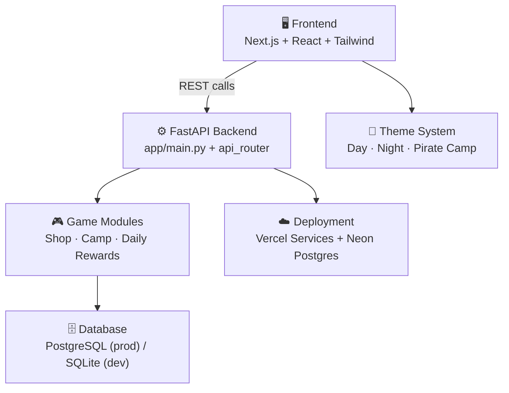

# 🏝️ VillageVerse

VillageVerse is a cozy island-life simulation with a Next.js frontend and a FastAPI backend — featuring a shop with real coin-based purchases, a pirate camp resource/upgrade system, daily login rewards, and a switchable day/night/pirate theme system.

## 🔗 Live Demo

> ⚠️ Add your deployed URL here once the Vercel build succeeds:
> **[https://your-project-name.vercel.app](https://your-project-name.vercel.app)**

## 🧱 Architecture Overview



| Block | Responsibility |
|---|---|
| **Frontend** | Next.js pages (Home, Shop, Inventory, Quests, Admin), Tailwind styling, Framer Motion animation |
| **FastAPI Backend** | Routes all `/api/*` requests, wires together the game modules |
| **Game Modules** | Shop (catalog + buy), Camp (gather + upgrade), Daily Rewards (streaks) |
| **Database** | SQLAlchemy async models; SQLite locally, PostgreSQL in production |
| **Theme System** | React Context-driven picker (Cozy Day / Starlight Night / Pirate Camp), persisted per-browser |
| **Deployment** | Vercel Services (`vercel.json`) routes `/` to the frontend and `/api/*` to the backend, backed by a hosted Postgres instance |

## 🛠️ Tech Stack

**Frontend:** Next.js 14, React 18, TypeScript, Tailwind CSS, Framer Motion
**Backend:** FastAPI, SQLAlchemy (async), Pydantic Settings, SlowAPI (rate limiting)
**Database:** PostgreSQL (production via Neon/Supabase) or SQLite (local dev)
**Deployment:** Vercel (frontend + backend as unified Services project)

## 📂 Project Structure

See `structure.txt` for the full file tree.

```
VillageVerse/
├── frontend/          # Next.js app
├── backend/
│   └── villageverse-backend/
│       └── app/       # FastAPI application
├── vercel.json        # Multi-service deployment config
└── docker-compose.yml # Local Postgres + backend container setup
```

## 🚀 Getting Started

### Prerequisites
See `node.txt` for Node.js/npm version requirements. Python 3.10+ is required for the backend.

### 1. Backend setup
```bash
cd backend/villageverse-backend
pip install -r requirements.txt
uvicorn app.main:app --reload
```
Runs at `http://127.0.0.1:8000` — interactive API docs at `http://127.0.0.1:8000/docs`.

### 2. Frontend setup
```bash
cd frontend
npm install
npm run dev
```
Runs at `http://localhost:3000`.

**Run both at once** — keep two terminals open, one per server; the frontend calls the backend directly over HTTP.

## 🎮 How to Use

- **Shop** (`/shop`): browse the item catalog, filter by category or theme (day/night/pirate), click an item to preview it, and hit **Buy** to spend real coins tracked server-side.
- **Camp mechanics** (via API, `/api/game/camp/*`): gather wood/stone/cloth from resource nodes (each has a respawn cooldown), then spend resources to upgrade your camp level.
- **Daily rewards** (via API, `/api/game/daily-reward/*`): claim once per day; the coin payout grows with your login streak.
- **Theme picker**: click the icon in the top-right of the header to switch between Cozy Day, Starlight Night, and Pirate Camp — your choice is remembered on your browser.
- **Admin / Quests / Inventory**: static preview pages, ready to be wired up to their own backend routes next.

## 📜 License

MIT License. This is an original educational/portfolio project inspired by the cozy life-simulation genre. It is not affiliated with or endorsed by Nintendo or any other game publisher.

## 👩‍💻 Author

**Kaweri Harinkhede**
